# Black Parrot Branch Predictor [](https://www.gnu.org/licenses/gpl-3.0)

## Intro
As part of our VLSI2 class at University of Washington, we seek to improve a part of the [BlackParrot](https://github.com/black-parrot/black-parrot) Open-Source RISC-V 
processor in terms of PPA (Power, Performance, Area) and/or simplicity. We decided to tackle the problem of improving the 
[branch predictor](https://en.wikipedia.org/wiki/Branch_predictor), since a better predictor can easily improve the overall
performance by reducing the number of misspredictions/revertions.

The current implementation is a fixed-width (=2) saturating counter [one-level bimodal branch predictor](https://en.wikipedia.org/wiki/Branch_predictor#One-level_branch_prediction).
In order to explore the whole design space, we generalized the existing implementation by imposing an adjustable saturating counter bit-width parameter on the one hand, and we implemented different branch predictors such as always-taken, gselect, gshare, two-level local and tournament. The major contribution is not only the RTL implementation of these predictors, but also a comprehensive study and comparison in terms of prediction performance and PPA between the designs.

## Setup
To gain the ability of comparison between the different implementations, we first started with the existing [test programs](https://github.com/black-parrot/black-parrot/tree/master/bp_common/test)
of black parrot, which reports the number of cycles each of the program takes ([verilator](https://www.veripool.org/wiki/verilator)
simulation). This approach comes with a couple of downsides. 

(1) Firstly, we are reporting cycles instead of accuracy (#correct predictions/#total branches).
This is problematic in multiple ways, e.g. what if the program does not contain any branches/only very few? what if the 
branches are only of a certain type?.

(2) Secondly, some of the test programs finish execution in only a few thousand cycles, while only a fraction of these cycles 
are spent on branch instructions. This drastically reduces the statistical relevance of our findings from these tests.

(3) Last but not least, since malfunctioning branch predictors only decrease the performance, but not the correct code execution
we have no notion of testing the correctness of our implementation. Recall: "Hardware is about 10x as hard to debug as 
software.", Part of Taylor's VLSI Axiom #5. In the case of a branch predictor, with a large internal state, it is even
almost impossible to write good tests by hand.

This reasoning above can be underlined well with one of our early cycle performance analysis. Even for larger tests such 
as the coremark benchmark, we even get slightly better performance (lower cycle count is better) with the primitive 
'always taken' implementation compared to the current 'bimodal' branch predictor.
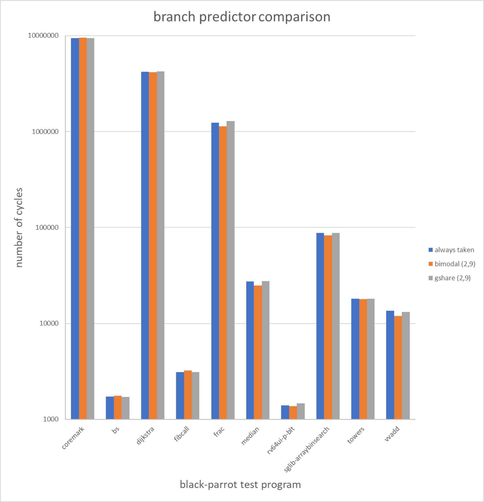

In order to overcome these limitations, we developed our own performance evaluation and testing system.

After being given a hint by Professor Taylor, we started investigating the use of branch traces from the most recent
[Championship Branch Prediction CBP-5](https://www.jilp.org/cbp2016). Since these files come in a complex encoding, we 
used their branch predictor test backbone and built a conversion utility that translates these files to a simple "branch_address branch_taken newline" format. The implementation details can be found in [bt9_reader](./bt9_reader). For our evaluation and simulation, we used four of the training files from different categories (`short_mobile_1`, `long_mobile_1`, `short_server_1`, `long_server_1`), each consisting of several millions of branches. The converted files can be found in [traces](./traces).

In order to solve the second issue of thoroughly test/simulate or design with a big amount of internal state, we decided 
to use [cocotb](https://github.com/cocotb/cocotb), which allows us to co-simulate our RTL code (using [verilator](https://www.veripool.org/wiki/verilator))
and our model of the predictor written in python. Furthermore, we can use the traces from CBP-5, simulate them on both the
RTL and python implementation and check if the output matches. This gives us high confidence of the correctness (considering 
the trace sizes). In addition to that, we can measure the actual accuracy (#correctly predicted/#all predictions) and do not
have to rely on the indirect measure of the number of cycles.
To get a better understanding of the working principle, we illustrated the functionality below:


## Branch Predictor Implementations

In this section, we will have a look at all branch predictor implementations, their functionality and there performance.

### Static Branch Predictors
Static branch predictors are very simple predictors used mostly in the earliest designs. They do not rely on the branch history
at runtime, but rather predict on the bases of the branch type.

### Always Not Taken
The always not taken branch predictor is a static and ultra light-weight (area, power) branch predictor. Like the name already
reveals, it simply predicts all branches as 'not taken'.

#### Conjecture:

__Accuracy__: We expect this branch predictor to perform badly, and specifically worse than its always taken counterpart. 
The reasoning is that even if "if/else" branches might work in favour for either of them, most loops are implemented in 
the following general loop scheme works strongly in favour of the 'always taken' predictor: 

C-Code:
```
x = 0;
while(x < 42){
    x++;
}
```
Assembly Version
```
        jmp     .L2
.L3:
        addl    $1, -4(%rbp)
.L2:
        cmpl    $41, -4(%rbp)
        jle     .L3
```
with `x=-4(%rbp)`

You note that the conditional jump `jle` is going to be 'taken' 42 times and only once 'not taken'.

__Predictions per Cycle__: Since there is no computation involved, the implementation should be able to run at almost every frequency.

__Area__: The area usage should be almost zero.

__Power__: The power usage should be almost zero.

More detailed evaluations and the integration into black-parrot can be found:
- [Detailed evaluation](./testbench_bp_always_taken/README.md)
- [BlackParrot Integration](https://github.com/andreaskuster/black-parrot/blob/uw_ee477_pparrot_wi20_branch_predictor_01_always_not_taken/bp_fe/src/v/bp_fe_bp.v#L28)


### Always Taken

The always taken branch predictor is a static and ultra light-weight (area, power) branch predictor. Like the name already
reveals, it simply predicts all branches as 'taken'.

#### Conjecture:

__Accuracy__: We expect this branch predictor to perform worse than the dynamical branch predictors, but better than 
its always taken counterpart.  The reasoning is that even if "if/else" branches might work in favour for either of them, most loops are implemented in 
the following general loop scheme works strongly in favour of the 'always taken' predictor:

C-Code:
```
x = 0;
while(x < 42){
    x++;
}
```
Assembly Version
```
        jmp     .L2
.L3:
        addl    $1, -4(%rbp)
.L2:
        cmpl    $41, -4(%rbp)
        jle     .L3
```
with `x=-4(%rbp)`

You note that the conditional jump `jle` is going to be 'taken' 42 times and only once 'not taken'.


__Predictions per Cycle__: Since there is no computation involved, the implementation should be able to run at almost every frequency.

__Area__: The area usage should be almost zero.

__Power__: The power usage should be almost zero.

More detailed evaluations and the integration into black-parrot can be found:
- [Detailed evaluation](./testbench_bp_always_taken/README.md)
- [BlackParrot Integration](https://github.com/andreaskuster/black-parrot/blob/uw_ee477_pparrot_wi20_branch_predictor_02_always_taken/bp_fe/src/v/bp_fe_bp.v#L33)

### Dynamic Branch Predictors
Dynamic branch predictors not only rely no the branch type, but also incorporate information about branch outcome at runtime.

Furthermore, the branch predictors we will see in this section can be generalised to consist of a branch history table 
(saturating counters representing the likelyhood of taking/not taking the branch, with an update mechanism) and a hash
function determining which counter to use.

### Bimodal
The bimodal branch predictor is a dynamic branch predictor and uses the lowest `bht_indx_width_p` bits as the hash function.

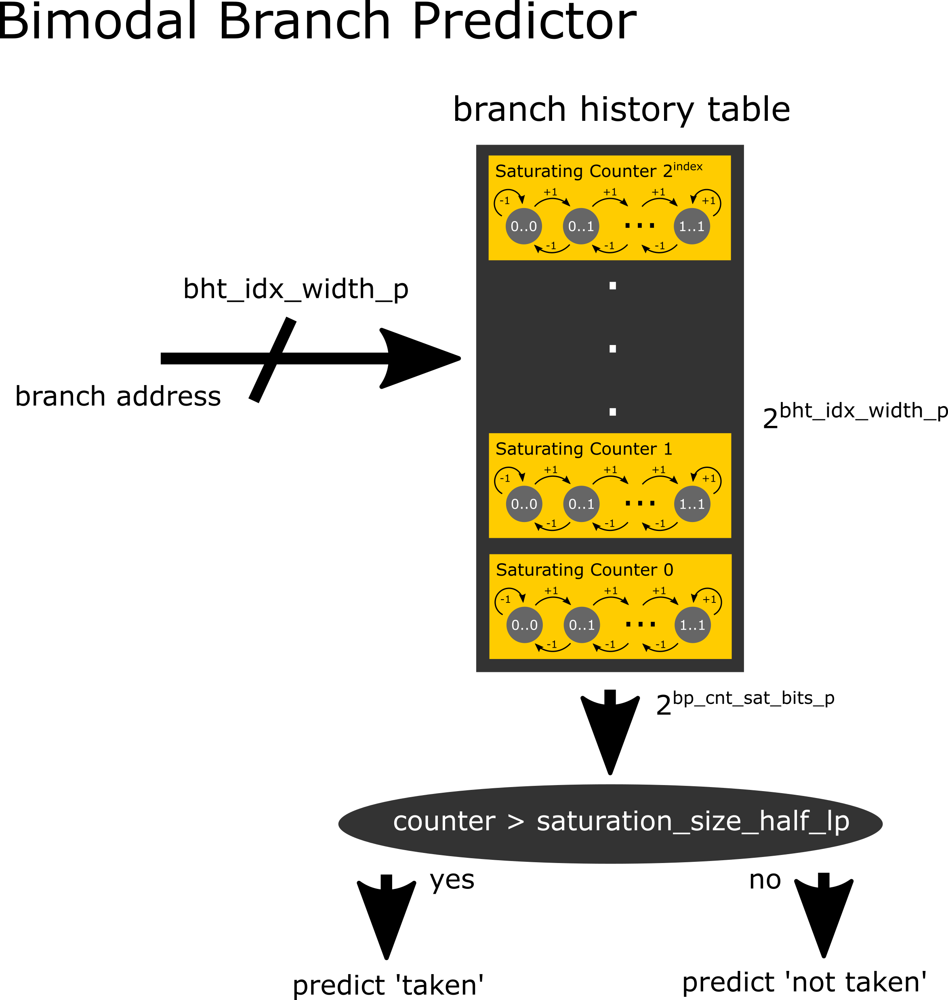 

__Accuracy__: Since the bimodal branch predictor solely relies on the address bits for the hash function, we expect this
predictor to be good for workloads with very few correlation between sequential branches. For such workloads, this predictor
should show better accuracy for smaller branch history table sizes, since this hash function does not spread very widely
and therefore we expect less collisions.  

__Predictions per Cycle / Critical Path__: TODO

__Area__: Since the computational part of the module is rather small, we expect the area to grow almost linear with the 
size of the branch history table.

__Power__: Since the computational part of the module is rather small, we expect the power to scale almost linear with the 
size of the branch history table.

More detailed evaluations and the integration into black-parrot can be found:
- [Detailed evaluation](./testbench_bp_bimodal/README.md)
- [BlackParrot Integration](https://github.com/andreaskuster/black-parrot/blob/uw_ee477_pparrot_wi20_branch_predictor_03_bimodal/bp_fe/src/v/bp_fe_bp.v#L38)


### Gshare

The gshare branch predictor is a dynamic branch predictor and uses the lowest `bht_indx_width_p` bits of the branch address 
and the branch history xored as the hash function.

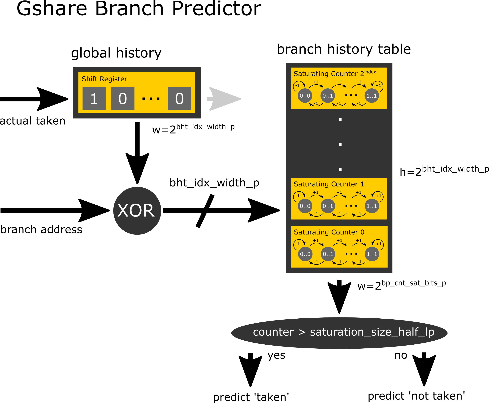 

__Accuracy__: Since applying biwise xor over all available input information (branch address and branch history) should spread
nicely over the whole hash image, we expect this predictor to perform very well on workloads with long branch correlation.
Furthermore, because of the broad spread, we expect that this predictor can improve a lot over larger branch history table
sizes.

__Predictions per Cycle / Critical Path__: TODO

__Area__: Since the computational part of the module is rather small, we expect the area to grow almost linear with the 
size of the branch history table plus the size of the branch history.

__Power__: Since the computational part of the module is rather small, we expect the power to scale almost linear with the 
size of the branch history table plus the size of the branch history.

More detailed evaluations and the integration into black-parrot can be found:
- [Detailed evaluation](./testbench_bp_gshare/README.md)
- [BlackParrot Integration](https://github.com/andreaskuster/black-parrot/blob/uw_ee477_pparrot_wi20_branch_predictor_04_gshare/bp_fe/src/v/bp_fe_bp.v#L56)


### Gselect

The gselect branch predictor is a dynamic branch predictor and uses the lowest `bht_indx_width_p - bp_n_hist` bits of 
the address, concatenated with `bp_n_hist`latest branch history bits as the hash function.


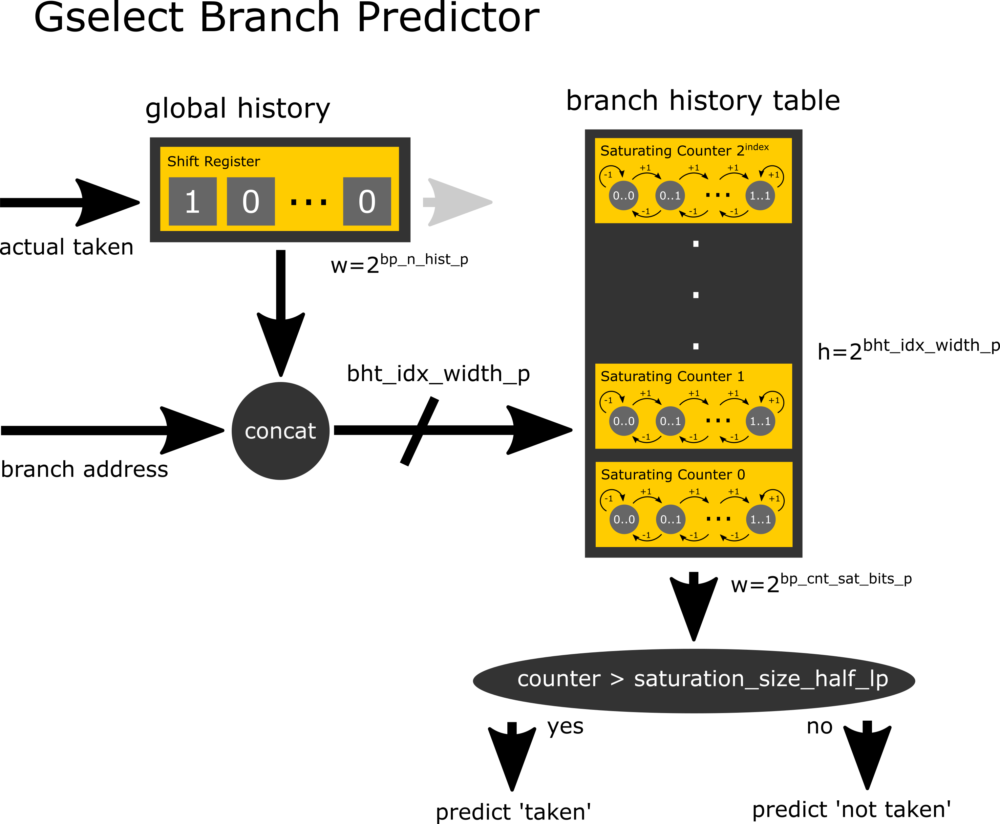 

__Accuracy__: The gselect branch predictor is a tradeoff between full spreading of the information (gshare) and only using
the branch address (bimodal). We therefore expect the result of this predictor to be somewhere between the two others. In
theory, in these of a workload that fits very well the combination of history bits and address bits selected for this 
implementation, it could also outperform the others.

__Predictions per Cycle / Critical Path__: TODO

__Area__: Since the computational part of the module is rather small, we expect the area to grow almost linear with the 
size of the branch history table plus the size of the branch history.

__Power__: Since the computational part of the module is rather small, we expect the power to scale almost linear with the 
size of the branch history table plus the size of the branch history.

More detailed evaluations and the integration into black-parrot can be found:
- [Detailed evaluation](./testbench_bp_gselect/README.md)
- [BlackParrot Integration](https://github.com/andreaskuster/black-parrot/blob/uw_ee477_pparrot_wi20_branch_predictor_05_gselect/bp_fe/src/v/bp_fe_bp.v#L76)


### Tournament

The tournament branch predictor is a dynamic branch predictor and uses a hybrid approach. One branch predictor uses the
branch address only as a hash function, while the second one uses the branch history shift register only. In order to 
choose which of both predictions we should use, there is an additional saturating counter, the selector, which gives trust
to either of them, depending on the correctness of their previous predictions. 

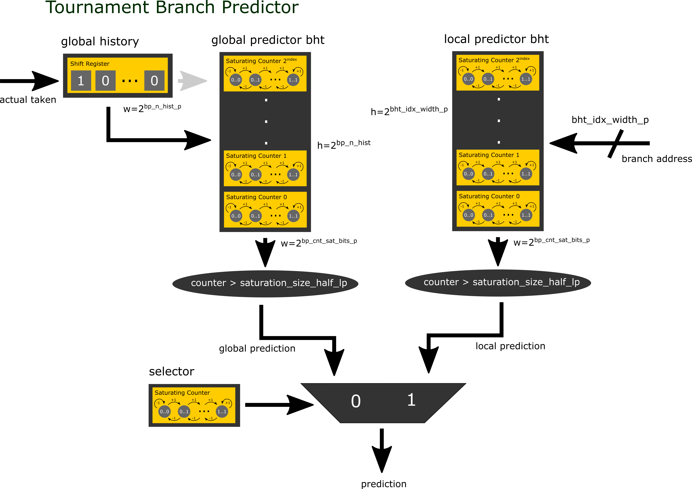 

__Accuracy__: While this branch prediction uses two branch predictors internally, it mostly gets the best result out of
both words. We therefore expect this one to perform reasonably close to the maximum value of both internal branch predictors.

__Predictions per Cycle / Critical Path__: TODO


__Area__: Since the computational part of the module is rather small, we expect the area to grow almost linear with the 
size of the branch history tables plus the size of the branch history.

__Power__: Since the computational part of the module is rather small, we expect the power to scale almost linear with the 
size of the branch history tables plus the size of the branch history.


More detailed evaluations and the integration into black-parrot can be found:
- [Detailed evaluation](./testbench_bp_tournament/README.md)
- [BlackParrot Integration](https://github.com/andreaskuster/black-parrot/blob/uw_ee477_pparrot_wi20_branch_predictor_06_tournament/bp_fe/src/v/bp_fe_bp.v#L95)


### Two-Level Local

The two-level local branch predictor uses the indirection over a (huge) correlation table consisting of branch address 
indexed branch histories. The history is later used as an index to the actual branch history table consisting of saturating
counters.

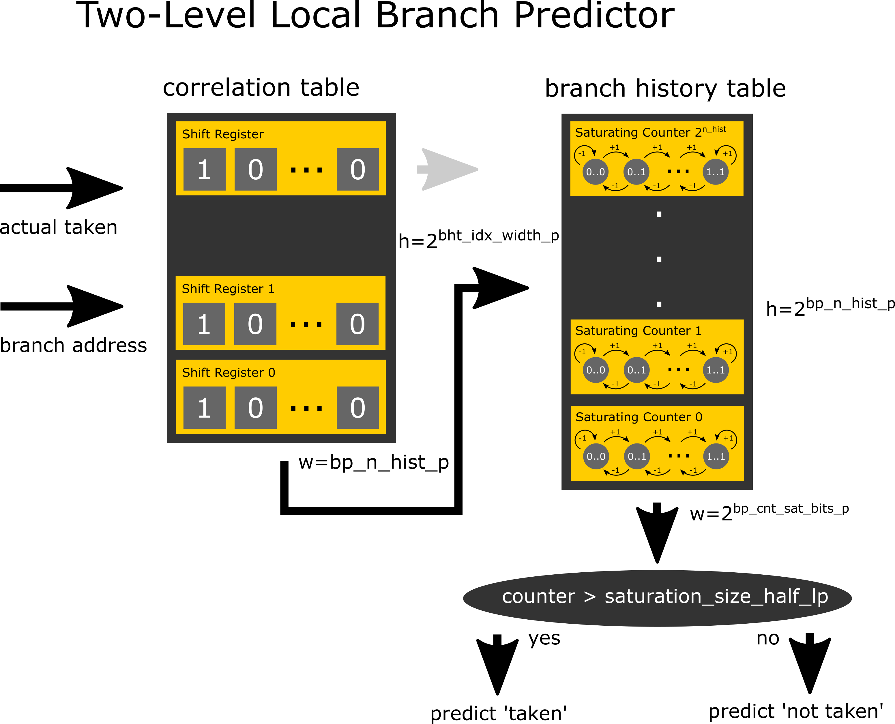 

__Accuracy__: Since this predictor basically stores all the information given to him (and uses it), it should outperform 
all others (with the grain of salt for using a lot more area/power). 

__Predictions per Cycle / Critical Path__: TODO

__Area__: Since the computational part of the module is rather small, we expect the area to grow almost linear with the 
size of the correlation table plus the branch history table.

__Power__: Since the computational part of the module is rather small, we expect the power to scale almost linear with the 
size of the correlation table plus the branch history table.


More detailed evaluations and the integration into black-parrot can be found:
- [Detailed evaluation](./testbench_bp_two_level_local/README.md)
- [BlackParrot Integration](https://github.com/andreaskuster/black-parrot/blob/uw_ee477_pparrot_wi20_branch_predictor_07_two_level_local/bp_fe/src/v/bp_fe_bp.v#L113)


### Neural Branch Predictors
Neural branch predictors found their way into modern high-performance/high missprediction penalty CPU designs (i.e. [AMD Ryzen](https://en.wikipedia.org/wiki/Ryzen), especially 
because of their ability to remember long history information without the necessity of exponential scale. But still, they
are resource hungry and we have to carefully balance and reduce unnecessary functionality in order to make them feasible 
for the black-parrot RISC-V processor.

### Perceptron

The [Perceptron Algorithm](https://en.wikipedia.org/wiki/Perceptron) is one of the most basic neural network algorithm. 
With limited latency and area/power budget, it is probably the most reasonable starting point for a neural branch predictor.

In order to further minimize the footprint, the model currently supports the following features:

- input: parameterized number of address index and branch history bits
- binary classification (branch taken/not taken)
- integer only data type (no float)
- single training round (aka single update of perceptron weights)
- single perceptron (another design choice could be to have multiple perceptrons, branch address indexed)
- fixed data width integers

 


This design is still __under development__. The current evaluations can be found:
- [Detailed evaluation](./testbench_bp_perceptron/README.md)
- [Implementation Details](./testbench_bp_perceptron)

## Findings

Generally, the problem of predicting the correct branch decision cannot be done previous to the evaluation of the
conditional branch statement (in the presence of I/O and random number generators). Furthermore, there is usually a tight
bound on the latency and resources (power/area) that are available for the implementation of such a predictor. Therefore,
all the predictors use heuristics and are greedy, which means that most likely there does not exist the best predictor, but
it is rather a balance between different tradeoffs.
These plots below provide insight into __how much information__ each of the branch predictors is capable of storing, 
given different amounts of input information (in the form of branch history, address bits). It is __important__ to note 
that the area and power requirements of different implementations might diverge significantly. For more information about
that, refer to the [theoretical power/area estimate](#theoretical-powerarea-estimate) and the findings from our backend flow.

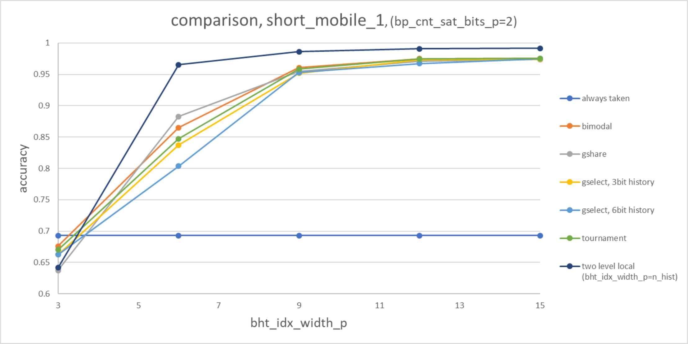

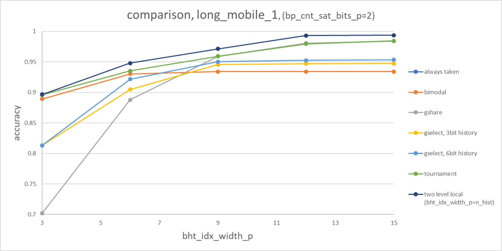

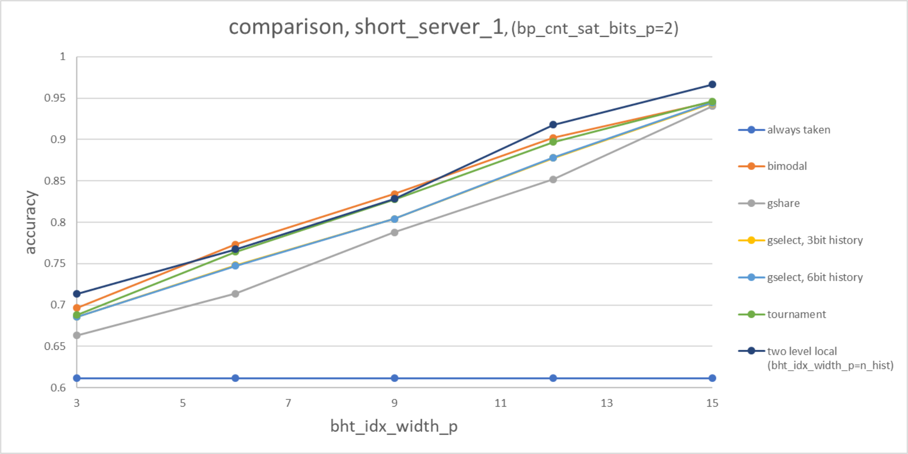

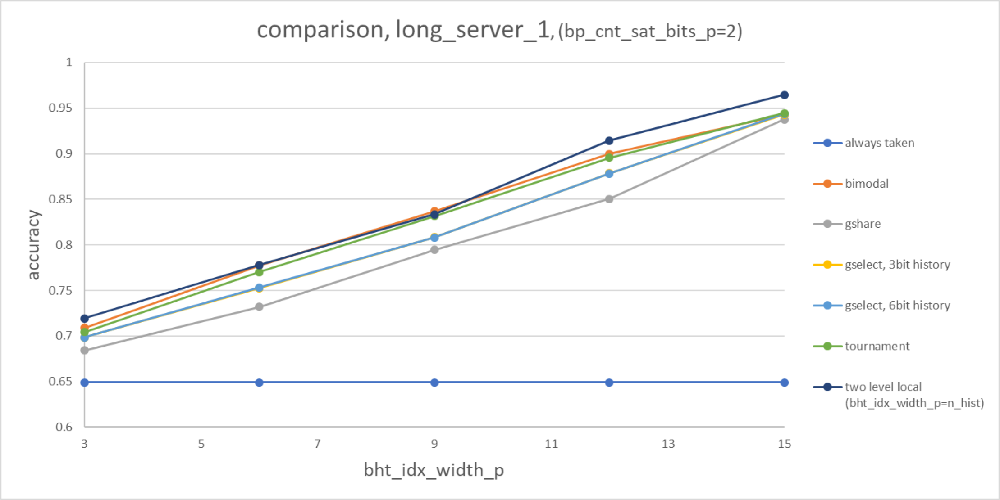

__always taken / always not taken__:
1. The conjecture about the performance increase of the 'always taken' over the 'always not taken' holds for all traces.
2. The conjecture that the static branch predictor are more inaccurate than the dynamic branch predictors holds too.

__bimodal__:
3. We can see that the bimodal predictor has higher accuracy for small table sizes compared to gshare and gselect. 
For some of the traces the break-even point is earlier than for others. We therefore assume (unfortunately we 
cannot check this) that this is indeed due to the amount of correlation.

__gshare__:
4. We can see that the gshare predictor is worse for smaller table size, but because of its 'good spread', we see that it 
outperforms most of the others for larger table sizes.

__gselect__:
5. Depending on the trace, the accuracy is usually in between or close to the one from gshare and/or bimodal.

__tournament__:
6. Some traces show pretty nicely what we expected (i.e. long_mobile_1) and for others, the accuracy is closeby or a little
lower.

__two-level local__:
7. It outperforms all the other most of the time. Sometimes even very significantly.


Last but not least, a not so obvious conjecture was that the initial testing method did not add much of insight/relevance.
With our own evaluation setup, we can e.g. distinguish quite clearly between the always taken and bimodal predictor performance,
which was not possible before.

Furthermore, running traces with over 10M branch instruction we did not prove, but we know with high certainty, that either
both RTL and the python model implementations are both correct or both wrong. But even if they would be wrong, according 
to Taylor's axiom, we are at least 10x faster in finding the bug! :)

## Proposal

Andreas:

Life is full of up and downs, and so is the choice of a good branch predictor. Doing the choice of your life within two
weeks is probably a bit short-handed, but there is still one little beautiful idea that stand out of the mass. Taking two 
orthogonal implementations, and gluing them together using the very same basic, but well working building block (saturating counter) 
allows to (mostly) get the best of both words (see graph below: tournament vs bimodal/gshare/gselect).

[](./evaluation/plots/comparison_short_mobile_1.png)

In my opinion, we should use the tournament branch predictor, since this approach scales performance very well (upon
changes of parameter bht_idx_width_p) with size, which is an important characteristic for the flexibility and re-usability
approach of black-parrot.


## Theoretical Power/Area Estimate

For this simplified power estimate model, we assume that the predictors power and area usage scales with its RAM size. 
We think that his is reasonable, since the remaining part of the predictors above has either a 

Below you can see a table with logarithmic size axis that show how the branch history table scales.

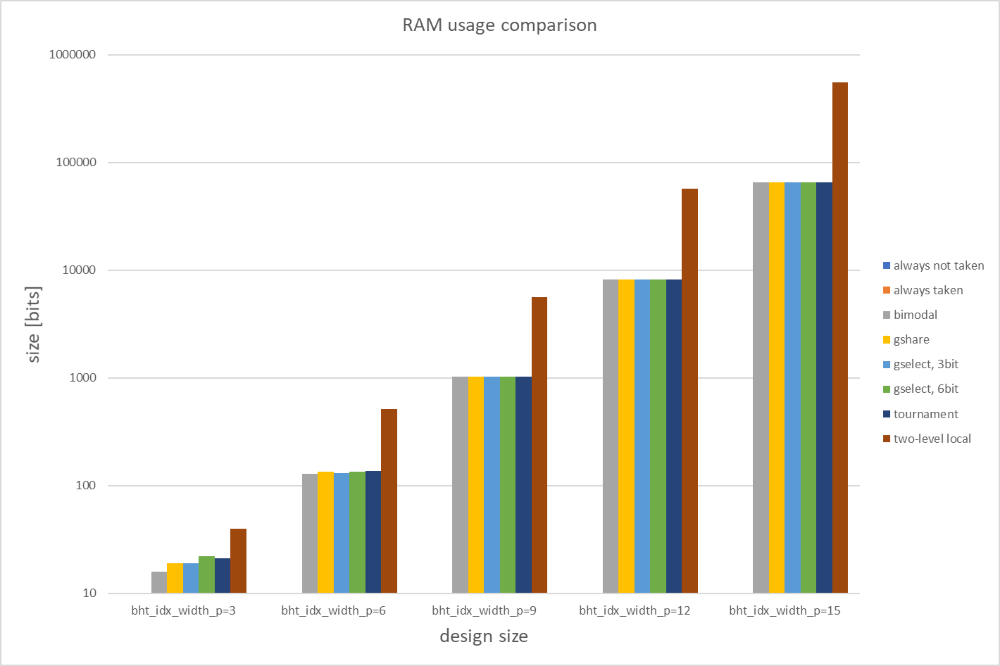

We can conclude that the branch predictors, except the two-level local bp can e directly compared while we have to take
the better accuracy of the two-level local pb with a grain of salt, due to its high cost in terms of area/power

## Black-Parrot Module Hierarchy

### FrontEnd


### BackEnd


### MemoryEnd
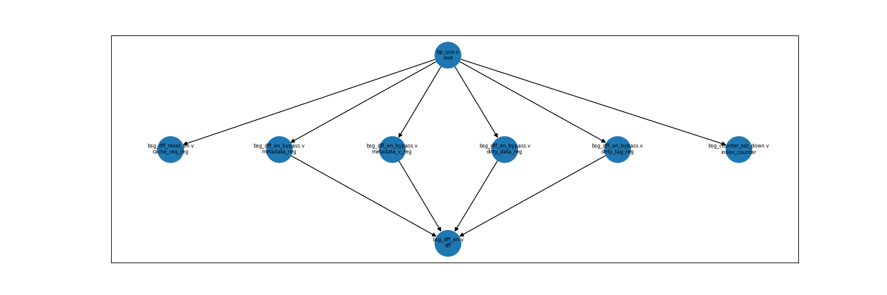


## Co-Simulation

1. Change into the testbench_NAME directory `cd testbench_NAME`
2. Execute the co-simulation by running `make`

In order to execute all testbenches automatically, you can run `make` in the root directory of the repo.


## Wave Form Viewer

1. Run the co-simulation first. This should generate a file `dump.vcd` in the testbench_NAME folder.
2. Open the waveform file using gtkwave `gtkwave dump.vcd`


## Prequisites

The following packages are required to run the simulation:
`sudo apt install virtualenv build-essential python3-dev gtkwave verilator libboost-all-dev`

To install all python packages, run the following command: `pip3 install -r requirements.txt`

## Reproducibility

We run our evaluation on the following system:
- `ubuntu 19.10 x86_64 kernel 5.3.0-40-generic`
- `python v3.8`
- `cocotb v1.3.0`
- `verilator v4.020 2019-10-06`
- `gcc v9.2.1`

The raw data we used for generating the plots can be found [here](./evaluation/results)

Unoptimized assembly code can be generated from C using: `gcc -S CODE.c -O0`. We added both C and assembly version 
[here](./testbench_bp_always_taken/while_assembly)

## Testing

More information about the traces can be fourn on their [official homepage](https://www.jilp.org/cbp2016/). Our traces 
are part of a large collection of training cases, which we converted using or modified [bt9 reader](./bt9_reader) to simple
traces of the form: `branch_address taken \n`. They can be found downloaded from [here](http://hpca23.cse.tamu.edu/cbp2016).

The bt9 conversion tool can be compiled using `cd bt9_reader && make` and used by executing `./bt9_reader INPUT_TRACE OUTPUT_FILE`

We used the following four traces for the evaluation with test file sizes (#branches):
- short_mobile_1.trace: 16'662'268 
- long_mobile_1.trace: 29'269'647
- short_server_1.trace: 230'692'528
- long_server_1.trace: 149'246'445


## Roadmap

Even though we tried to implement our branch predictor designs as generic as possible, we could still not incorporate all
extra tweaks and tricks we found on the web. 

We encourage people to contribute to this repo by adding additional testbenches. A few ideas for superior designs might be:

- Perceptron Branch Predictor: The first version of the model is already implemented. We have to find a good balance between
a good prediction rate and the complexity of the hardware (in terms of resources and critical path).
    - https://www.cs.utexas.edu/~lin/papers/hpca01.pdf
    - http://hpca23.cse.tamu.edu/taco/pdfs/hpca7_dist.pdf

- TAGE:
    - http://www.irisa.fr/caps/people/seznec/JILP-COTTAGE.pdf
    - https://pharm.ece.wisc.edu/papers/badgr_iccd16.pdf

- Furthermore, so far, we only used the branch address and branch history information for our branch predictions. There 
might be some headroom for improvement by appying additional heuristics such as looking at the type of branch instruction.

## Contributions
Any kind of feedback/issues or pull requests are welcome.

For moral support, you can also buy me a cup of coffee:
[](https://www.paypal.com/cgi-bin/webscr?cmd=_donations&business=QVJSS734ZPLYE&currency_code=CHF&source=url)

## Credits
- https://github.com/black-parrot/black-parrot
- https://cocotb.readthedocs.io/en/latest/index.html
- https://www.veripool.org/wiki/verilator
- https://github.com/antmicro/cocotb-verilator-build
- https://web.engr.oregonstate.edu/~benl/Projects/branch_pred/#l3
- https://en.wikipedia.org/wiki/Branch_predictor#Local_branch_prediction
- http://people.cs.pitt.edu/~childers/CS2410/slides/lect-branch-prediction.pdf
- https://medium.com/@thomascountz/19-line-line-by-line-python-perceptron-b6f113b161f3
