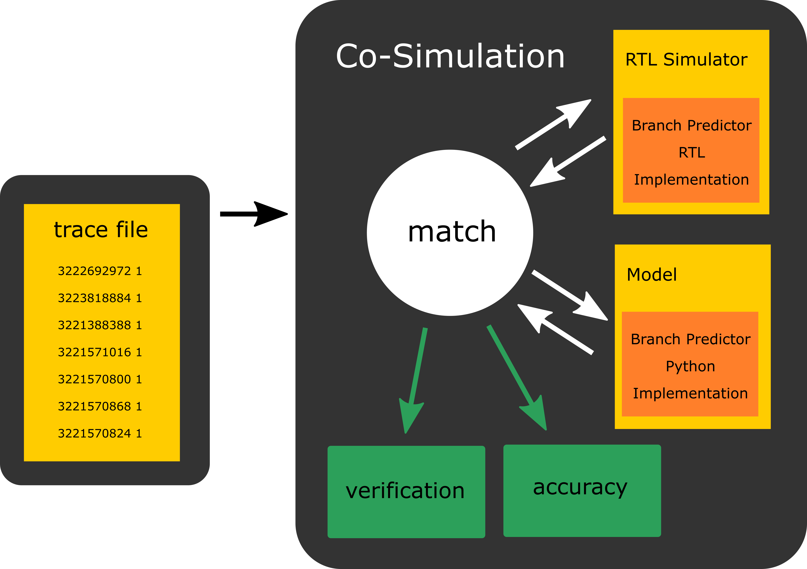

# Black Parrot Branch Predictor 

## Intro
As part of our VLSI2 class at University of Washington, we seek to improve a part of the [BlackParrot](https://github.com/black-parrot/black-parrot) Open-Source RISC-V 
processor in terms of PPA (Power, Performance, Area) and/or simplicity. We decided to tackle the problem of improving the 
[branch predictor](https://en.wikipedia.org/wiki/Branch_predictor), since a better predictor can easily improve the overall
performance by reducing the number of misspredictions/revertions.

The current implementation is a fixed-width (=2) saturating counter [one-level bimodal branch predictor](https://en.wikipedia.org/wiki/Branch_predictor#One-level_branch_prediction).
In order to explore the whole design space, we generalized the imposing a adjustable saturating counter bit-width parameter
on the one hand, and by implementing different branch predictors such as always-taken, gselect, gshare, two-level local and
tournament. The major contribution is not only the RTL implementation of these predictors, but also a comprehensive study 
and comparison in terms of prediction performance and PPA between the designs.

## Setup
To gain the ability of comparison between the different implementations, we first started with the existing [test programs](https://github.com/black-parrot/black-parrot/tree/master/bp_common/test)
of black parrot, which reports the number of cycles each of the program takes ([verilator](https://www.veripool.org/wiki/verilator)
simulation). This approach comes with a couple of downsides. 

(1) Firstly, we are reporting cycles instead of accuracy (#correct predictions/#total branches).
This is problematic in multiple ways, e.g. what if the program does not contain any branches/only very few? what if the 
branches are only of a certain type?.

(2) Secondly, some of the test programs finish execution in only a few thousand cycles, while only a fraction of these cycles 
are spent on branch instructions. This drastically reduces the statistical relevance of our findings from these tests.

(3) Last but not least, since malfunctioning branch predictors only decrease the performance, but not the correct code execution
we have no notion of testing the correctness of our implementation. Recall: "Hardware is about 10x as hard to debug as 
software.", Part of Taylor's VLSI Axiom #5. In the case of a branch predictor, with a large internal state, it is even
almost impossible to write good tests by hand.

This reasoning above can be underlined well with one of our early cycle performance analysis. Even for larger tests such 
as the coremark benchmark, we even get slightly better performance (lower cycle count is better) with the primitive 
'always taken' implementation compared to the current 'bimodal' branch predictor.

In order to overcome these limitations, we developed our own performance evaluation and testing system.

After being given a hint by Professor Taylor, we started investigating the use of branch traces from the most recent
[Championship Branch Prediction CBP-5](https://www.jilp.org/cbp2016). 

## Branch Predictor Implementations

### Always Not Taken

[Detailed evaluation](./testbench_bp_always_taken/README.md)
[BlackParrot Integration](https://github.com/andreaskuster/black-parrot/blob/uw_ee477_pparrot_wi20_branch_predictor_01_always_not_taken/bp_fe/src/v/bp_fe_bp.v#L28)

### Always Taken

[Detailed evaluation](./testbench_bp_always_taken/README.md)
[BlackParrot Integration](https://github.com/andreaskuster/black-parrot/blob/uw_ee477_pparrot_wi20_branch_predictor_02_always_taken/bp_fe/src/v/bp_fe_bp.v#L33)

### Bimodal

[Detailed evaluation](./testbench_bp_bimodal/README.md)
[BlackParrot Integration](https://github.com/andreaskuster/black-parrot/blob/uw_ee477_pparrot_wi20_branch_predictor_03_bimodal/bp_fe/src/v/bp_fe_bp.v#L38)

### Gshare

[Detailed evaluation](./testbench_bp_gshare/README.md)
[BlackParrot Integration](https://github.com/andreaskuster/black-parrot/blob/uw_ee477_pparrot_wi20_branch_predictor_04_gshare/bp_fe/src/v/bp_fe_bp.v#L56)

### Gselect

[Detailed evaluation](./testbench_bp_gselect/README.md)
[BlackParrot Integration](https://github.com/andreaskuster/black-parrot/blob/uw_ee477_pparrot_wi20_branch_predictor_05_gselect/bp_fe/src/v/bp_fe_bp.v#L76)

### Tournament

[Detailed evaluation](./testbench_bp_tournament/README.md)
[BlackParrot Integration](https://github.com/andreaskuster/black-parrot/blob/uw_ee477_pparrot_wi20_branch_predictor_06_tournament/bp_fe/src/v/bp_fe_bp.v#L95)

### Two-Level Local

[Detailed evaluation](./testbench_bp_two_level_local/README.md)
[BlackParrot Integration](https://github.com/andreaskuster/black-parrot/blob/uw_ee477_pparrot_wi20_branch_predictor_07_two_level_local/bp_fe/src/v/bp_fe_bp.v#L113)

### Perceptron

[Detailed evaluation](./testbench_bp_perceptron/README.md)
[BlackParrot Integration]()

## Findings

## Co-Simulation

1. Change into the testbench_NAME directory `cd testbench_NAME`
2. Execute the co-simulation by running `make`

In order to execute all testbenches automatically, you can run `make` in the root directory of the repo.

## Wave Form Viewer

1. Run the co-simulation first. This should generate a file `dump.vcd` in the testbench_NAME folder.
2. Open the waveform file using gtkwave `gtkwave dump.vcd`

## Prequisites

The following packages are required to run the simulation:
`sudo apt install virtualenv build-essential python3-dev gtkwave verilator libboost-all-dev`

To install all python packages, run the following command: `pip3 install -r requirements.txt`

## Reproducibility

We run our evaluation on the following system:
- `ubuntu 19.10 x86_64 kernel 5.3.0-40-generic`
- `python v3.8`
- `cocotb v1.3.0`
- `verilator v4.020 2019-10-06`

The raw data we used for generating the plots can be found [here](./evaluation/results)

## Testing

More information about the traces can be fourn on their [official homepage](https://www.jilp.org/cbp2016/). Our traces 
are part of a large collection of training cases, which we converted using or modified [bt9 reader](./bt9_reader) to simple
traces of the form: `branch_address taken \n`. They can be found downloaded from [here](http://hpca23.cse.tamu.edu/cbp2016).

The bt9 conversion tool can be compiled using `cd bt9_reader && make` and used by executing `./bt9_reader INPUT_TRACE OUTPUT_FILE`

We used the following four traces for the evaluation with test file sizes (#branches):
- short_mobile_1.trace: 16'662'268 
- long_mobile_1.trace: 29'269'647
- short_server_1.trace: 230'692'528
- long_server_1.trace: 149'246'445

## Roadmap

Even though we tried to implement our branch predictor designs as generic as possible, we could still not incorporate all
extra tweaks and tricks we found on the web. 

We encourage people to contribute to this repo by adding additional testbenches. A few ideas for superior designs might be:

- Perceptron Branch Predictor: The first version of the model is already implemented. We have to find a good balance between
a good prediction rate and the complexity of the hardware (in terms of resources and critical path).
    - https://www.cs.utexas.edu/~lin/papers/hpca01.pdf
    - http://hpca23.cse.tamu.edu/taco/pdfs/hpca7_dist.pdf

- TAGE:
    - http://www.irisa.fr/caps/people/seznec/JILP-COTTAGE.pdf
    - https://pharm.ece.wisc.edu/papers/badgr_iccd16.pdf

- Furthermore, so far, we only used the branch address and branch history information for our branch predictions. There 
might be some headroom for improvement by appying additional heuristics such as looking at the type of branch instruction.

## Contributions
Any kind of feedback or pull requests with additional testbenches are welcome.

## Credits
- https://github.com/black-parrot/black-parrot
- https://cocotb.readthedocs.io/en/latest/index.html
- https://www.veripool.org/wiki/verilator
- https://github.com/antmicro/cocotb-verilator-build
- https://web.engr.oregonstate.edu/~benl/Projects/branch_pred/#l3
- https://en.wikipedia.org/wiki/Branch_predictor#Local_branch_prediction
- http://people.cs.pitt.edu/~childers/CS2410/slides/lect-branch-prediction.pdf
- https://medium.com/@thomascountz/19-line-line-by-line-python-perceptron-b6f113b161f3