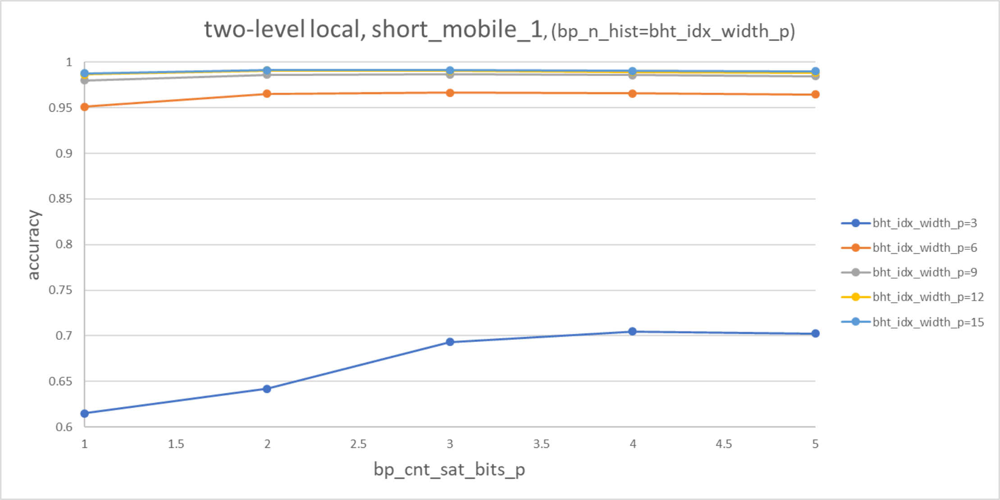
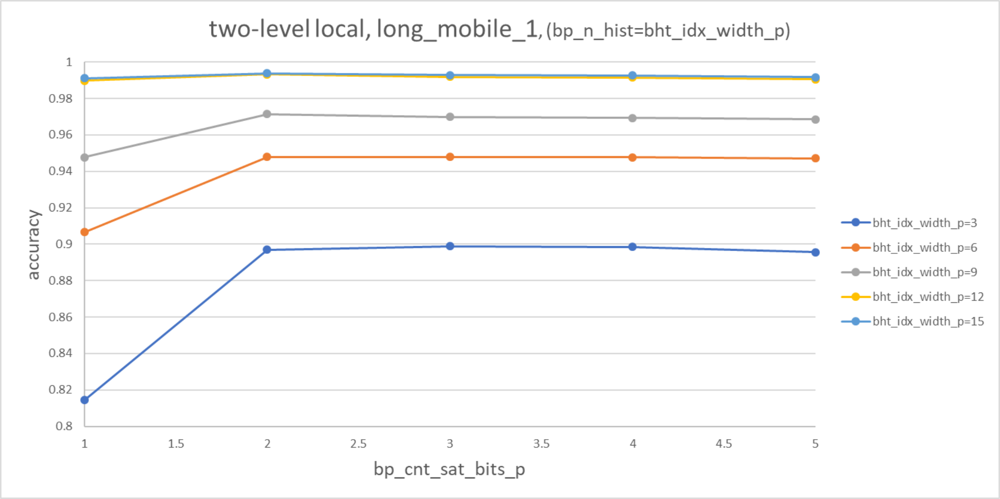
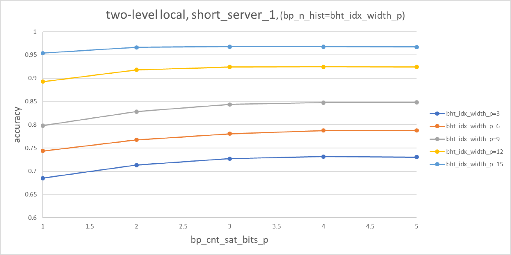
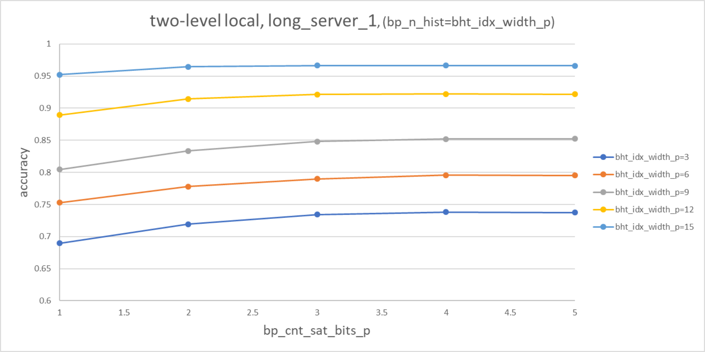
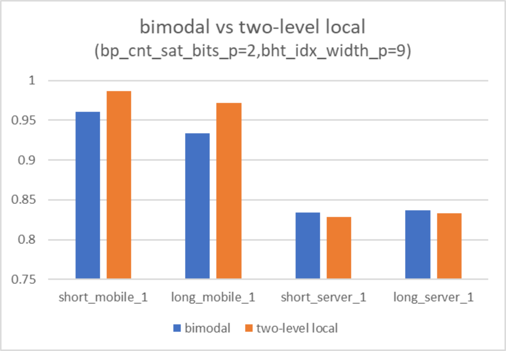

## Two-Level Local Evaluation

Comparison with the current black-parrot implementation:

__Note:__ This is a comparison for bp_cnt_sat_bits=2 and bh_indx_width_p=9, which is the default
value currently used in black parrot. Several predictors might out-perform the bimodal predictor for
slightly different bh_indx_width_p values (see [here](../README.md#theoretical-powerarea-estimate))

There are two main observations:
- Saturating counters should probably have two or three bits and the get worse with more, most likely due to the longer 
learning/re-learning phase.
- The (default) behaviour of hash functions: the bigger the image size to map into, the less collisions 
and therefore the higher the accuracy.

